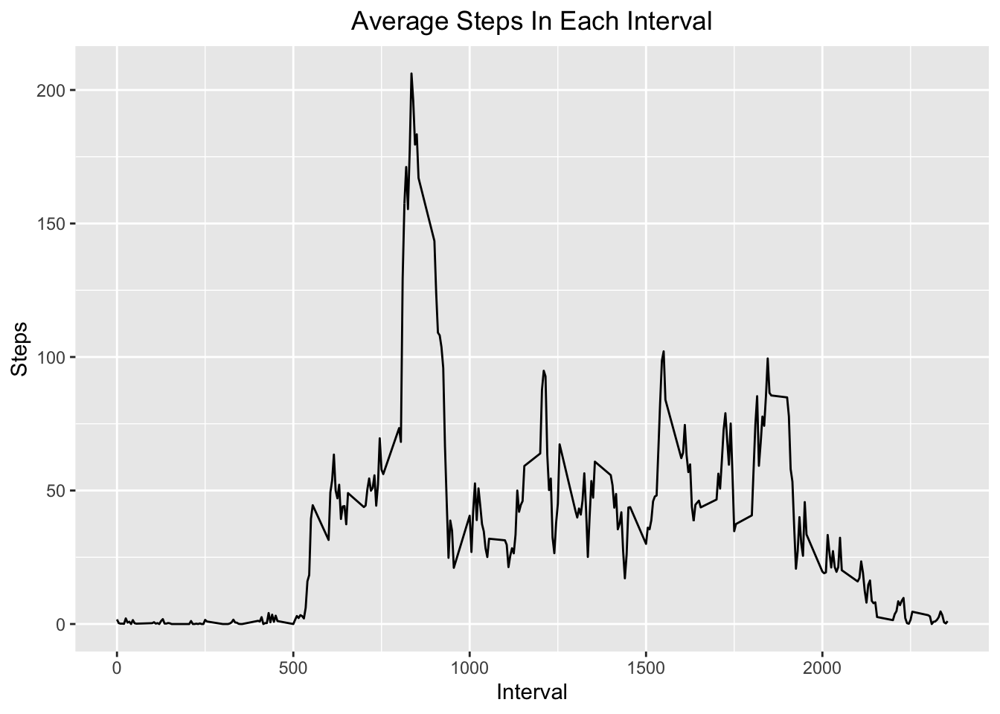

### Loading in data  

##### 1. Load the data.  


```r
library(ggplot2)
activity_data<-read.csv("activity.csv")
activity_data$date<-as.POSIXct(activity_data$date, format="%Y-%m-%d")
```

##### 2. Process/transform the data (if necessary) into a format suitable for your analysis.  

    No transformation of the data is necessary in this step.
    
### What is mean total number of steps taken per day?  

##### 1. Calculate the total number of steps taken per day.  


```r
steps_per_day<-aggregate(steps~date,data=activity_data, FUN=sum)
```

##### 2. Make a histogram of the total number of steps taken each day.  


```r
ggplot(steps_per_day,aes(steps))+geom_histogram(bins=20, color="navy", fill="skyblue2", size=.2)+labs(x="Steps", y="Count")+ggtitle("Steps per Day")+theme(plot.title = element_text(hjust = 0.5))
```


##### 3. Calculate and report the mean and median of the total number of steps taken per day  


```r
mean_steps<-format(mean(steps_per_day$steps),scientific=F)
med_steps<-format(median(steps_per_day$steps),scientific=F)
```

The mean steps per day is 10766.19.

The median steps per day is 10765.  

### What is the average daily activity pattern?  

##### 1. Make a time series plot (i.e. type = "l") of the 5-minute interval (x-axis) and the average number of steps taken, averaged across all days (y-axis).  


```r
int_5_min<-aggregate(steps~interval, activity_data, FUN=mean)
ggplot(int_5_min, aes(x=interval,y=steps) )+
  geom_line()+
  ggtitle("Average Steps In Each Interval")+
  xlab("Interval")+
  ylab("Steps")+ 
  theme(plot.title = element_text(hjust = 0.5))
```



##### 2. Which 5-minute interval, on average across all the days in the dataset, contains the maximum number of steps?  


```r
max<-int_5_min[int_5_min$steps==max(int_5_min$steps),]
max_round<-round(max, 2)
```

Interval 835 contains the maximum number of steps with 206.1698113 steps.  

### Imputing missing values  

##### 1. Calculate and report the total number of missing values in the dataset (i.e. the total number of rows with NAs).  


```r
NAdays<-sum(is.na(activity_data$steps))
```

The total number of missing values in the dataset is 2304.  

##### 2. Devise a strategy for filling in all of the missing values in the dataset. The strategy does not need to be sophisticated. For example, you could use the mean/median for that day, or the mean for that 5-minute interval, etc.  

Missing values will be filled in with the average for that particular day of the week and interval. Matching the data by both interval and day of the week won't disrupt the data if looking for patterns among the intervals or the days of the week.  

##### 3. Create a new dataset that is equal to the original dataset but with the missing data filled in.  


```r
activity_data$Day<-weekdays(activity_data$date)
activity_data2<-activity_data[complete.cases(activity_data),]
new_dataset<-activity_data
day_int_avg<-aggregate(steps~interval+Day, activity_data2, FUN=mean,na.rm=TRUE)
for (x in activity_data$steps){
  ifelse(is.na(activity_data$steps[x])==TRUE, y<-day_int_avg$steps[ match(paste(activity_data$Day[x] , activity_data$interval[x]), paste(day_int_avg$Day,day_int_avg$interval))],y<-activity_data$steps[x] )
     new_dataset$steps[x]<-y
   }
```

##### 4. Make a histogram of the total number of steps taken each day and calculate and report the mean and median total number of steps taken per day. Do these values differ from the estimates from the first part of the assignment? What is the impact of imputing missing data on the estimates of the total daily number of steps? 


```r
steps_per_day2<-aggregate(steps~date,data=new_dataset, FUN=sum)
ggplot(steps_per_day2,aes(steps))+geom_histogram(bins=20, color="navy", fill="skyblue2", size=.2)+labs(x="Steps", y="Count")+ggtitle("Steps per Day (Accounting For Missing Data)")+theme(plot.title = element_text(hjust = 0.5))
```


```r
mean_steps2<-format(mean(steps_per_day2$steps),scientific=F)
med_steps2<-format(median(steps_per_day2$steps),scientific=F)
```

Mean steps per day in the new dataset is 10738.3 and the median is 10682.5, versus 10766.19 and 10765 from the original dataset, respectively.  
The new mean and median are slightly lower than for the original dataset. This might be because we used data lower than the median and mean in the original dataset to replace missing values, which would bring down the two statistics.  

### Are there differences in activity patterns between weekdays and weekends?  

##### 1. Create a new factor variable in the dataset with two levels – “weekday” and “weekend” indicating whether a given date is a weekday or weekend day.  
  

```r
new_dataset$Weekday<-ifelse(new_dataset$Day %in% c("Saturday","Sunday"), "weekend", "weekday")
new_dataset$Weekday<-as.factor(new_dataset$Weekday)
```
  
##### 2. Make a panel plot containing a time series plot (i.e. type = "l") of the 5-minute interval (x-axis) and the average number of steps taken, averaged across all weekday days or weekend days (y-axis).  


```r
weekends<- new_dataset[new_dataset$Weekday=="weekend",]
weekday<-new_dataset[new_dataset$Weekday=="weekday",]
weekend_steps<- aggregate(steps~interval, weekends, FUN= mean)
weekend_steps$Weekday<-as.factor("Weekends")
weekday_steps<- aggregate(steps~interval, weekday, FUN= mean)
weekday_steps$Weekday<-as.factor("Weekdays")
steps<-rbind(weekday_steps, weekend_steps)
ggplot(steps, aes(interval, steps, color=Weekday))+geom_line(show.legend=FALSE)+ facet_wrap(~Weekday, nrow =2, ncol = 1)+ggtitle("Average Steps by Time of Day")+theme(plot.title = element_text(hjust = 0.5))
```


